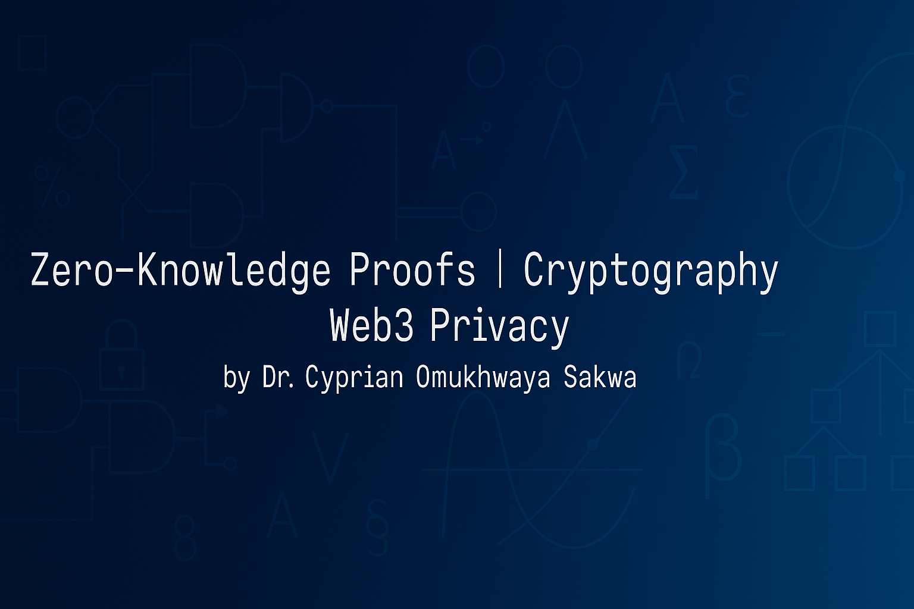

  

# 👋 Hi, I'm Dr. Cyprian Omukhwaya Sakwa

🎓 University Lecturer | 🔐 Cryptography & Blockchain Researcher | 🧮 Pure Mathematics PhD  
🔭 Currently building zero-knowledge circuits in Noir & teaching Web3 cryptography at Web3Clubs

I build zero-knowledge proof systems that protect privacy, enhance security, and empower decentralized apps.
---
## 🔬 My ZK Projects

| Project | Description |
|--------|-------------|
| [`prove_threshold_policy`](https://github.com/cypriansakwa/prove_threshold_policy) | Prove compliance with a fixed score threshold using a hidden input. |
| [`prove_weighted_threshold_compliance`](https://github.com/cypriansakwa/prove_weighted_threshold_compliance) | ZK circuit for weighted secret inputs + public offset == public score. |
| [`zkp_linear_check`](https://github.com/cypriansakwa/zkp_linear_check) | Linear condition verifier using Noir with Solidity integration. |
| [`zk-age-verification`](https://github.com/cypriansakwa/zk-age-verification) | Noir circuit for private age range checks. |
---

## 🌍 Featured In

//- 🧠 [awesome-noir](https://github.com/noir-lang/awesome-noir)
//- 🧠 [awesome-zk](https://github.com/ventali/awesome-zk)
- 🌐 [electric-capital/crypto-ecosystems](https://github.com/electric-capital/crypto-ecosystems)

---

## 🛠️  Tech I Use

---
## ✨ Interests

- Verifiable Homomorphic Encryption
- Noir-to-Solidity Verifiers
- zk-SNARK DSL integrations
- Cryptography Education & ZK bootcamps
---
### 📣 Speaking Engagements
- 🗣️ *Rust & Cryptography Symposium* — ZK Proofs in Noir
- 🎓 *ZK Education Series* at Web3Clubs

---

### 🤝 Let's Collaborate
- 🔍 Interested in privacy-preserving protocols, ZKPs, and verifiable computation.
- 💌 Reach out via [X(Twitter)](https://twitter.com/cypriansakwa) | [LinkedIn](https://linkedin.com/in/cypriansakwa) | [GitHub](https://github.com/cypriansakwa)|
---
## 💸 Support 

I'm open to:
- Gitcoin Grants
- Open-source Funding
---
*Funders, ZK Researchers, and Builders welcome!*

